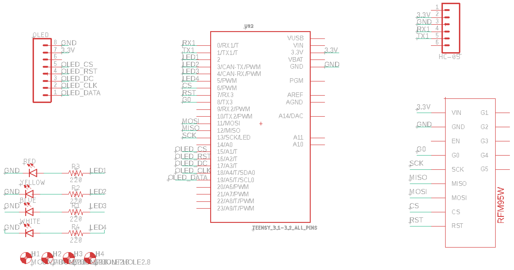

# WE Aero Design Ground Station Utility Hardware

## Goal
The hardware contains a radio and bluetooth module to allow communications between the plane's onboard system and the groundstation web server. It also contains an OLED screen to display basic information to the user as data is sent and recieved.  

## Design
Below are screenshots of the current revision of the schematic and board (created in Eagle).

### Schematic

### Board

## Features
#### Radio
[RFM95W](https://www.adafruit.com/product/3072)

#### Bluetooth
[HC-05](https://components101.com/wireless/hc-05-bluetooth-module)

#### OLED
[128x64 OLED](https://www.adafruit.com/product/326)

## TODO
- [x] Create schematic
- [x] Solder board
- [ ] Test Board
