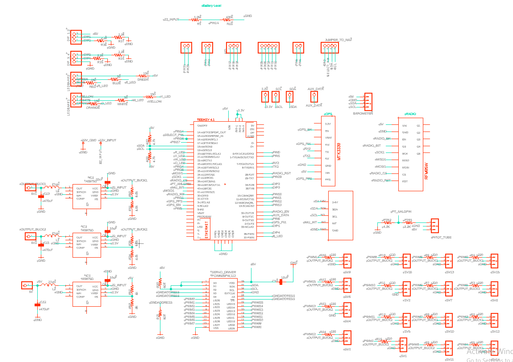
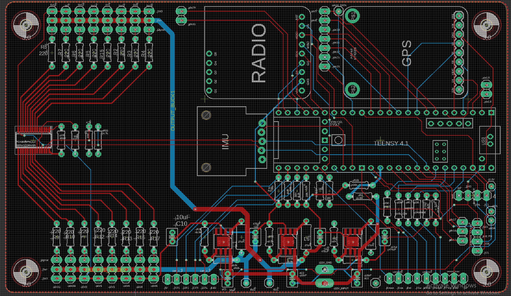
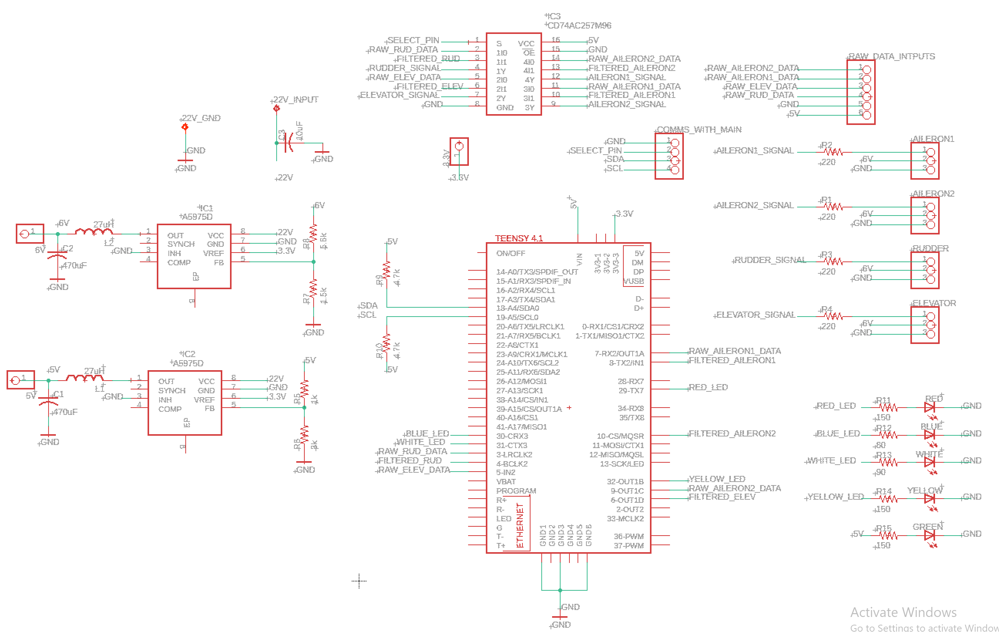
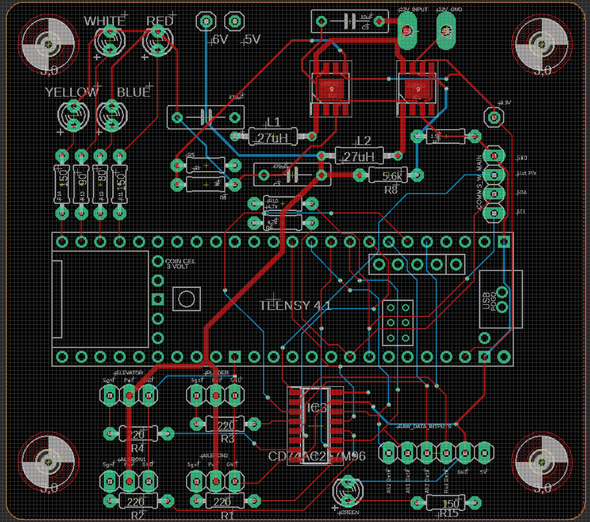

# WE Aero Design Onboard Hardware

## Goal
The hardware soloution will contain sensors that allow the team to accurately determine the height and position of the aircraft at any given moment. Also, the system should allow for communication with the ground station through an onboard radio. Logging of in-flight data and accurate GPS information will be necessary. Finally, the system must be able to control 16 individual servos or DC motors.

The team would also like to implement flight stabilization by activating a secondary Teensy which would control four servos attached to control surfaces: 2 aileron, 1 rudder, and 1 elevator. Activation of the secondary Teensy will be done by the Main Teensy. 

## Design
Below are screenshots of the current revision of the schematic and board of the Navigation and Main Teensy (created in Eagle).

### Schematic of Main Teensy

### Board of Main Teensy

### Schematic of Navigation Teensy

### Board of Navigation Teensy

## Features
#### Teensy
[Teensy 4.1](https://www.digikey.ca/en/products/detail/sparkfun-electronics/DEV-16996/13158152)

#### Radio
[RFM95W](https://www.adafruit.com/product/3072)

#### IMU
[ICM20948](https://www.digikey.ca/en/products/detail/pimoroni-ltd/PIM448/10246391)

#### Environment Sensing
[BMP280](https://www.digikey.ca/en/products/detail/adafruit-industries-llc/2651/5604371)

#### Pitot Tube
[Pitot Tube-MPXV7002DP](https://www.digikey.ca/en/products/detail/nxp-usa-inc/MPXV7002DP/1168436)

#### GPS
[Adafruit Ultimate GPS Breakout](https://www.digikey.ca/en/products/detail/adafruit-industries-llc/746/5353613)

#### Servo Driver
[PCA9685PW,112](https://www.digikey.ca/en/products/detail/nxp-usa-inc/PCA9685PW112/2034324)

#### Multiplexer
[CD74AC257M96](https://www.digikey.ca/en/products/detail/texas-instruments/CD74AC257M96/1691832)

#### Power
[A5975D](https://www.digikey.ca/en/products/detail/stmicroelectronics/A5975D/4357599)

## TODO
- [x] Select parts
- [x] Create schematic
- [x] Layout board
- [x] Route board
- [ ] Order board
- [ ] Test board
